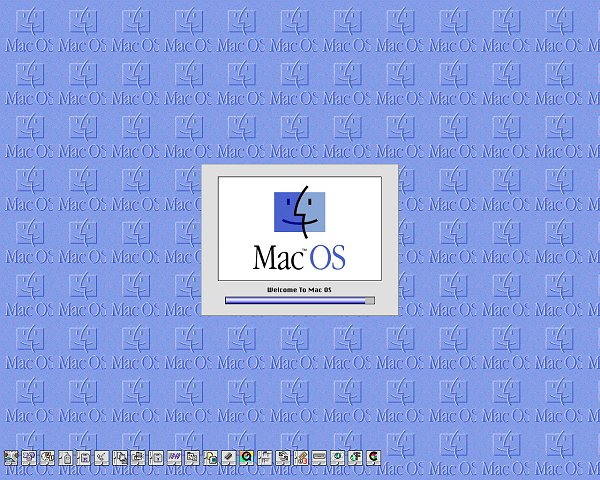



## MacBoot

### Description

None really.. its just an imitation Mac boot up sequence. Has some API sound playing, screen capture routine, resource file use etc etc.. ok to learn a few things from..

Some sections of the code have been obtained from various sources on PSC
 
### More Info
 

             |
---                |---
**Submitted On**   |2002-04-22 19:53:08
**By**             |[Matzy](https://github.com/Planet-Source-Code/PSCIndex/blob/master/ByAuthor/matzy.md)
**Level**          |Intermediate
**User Rating**    |5.0 (20 globes from 4 users)
**Compatibility**  |VB 6\.0
**Category**       |[Jokes/ Humor](https://github.com/Planet-Source-Code/PSCIndex/blob/master/ByCategory/jokes-humor__1-40.md)
**World**          |[Visual Basic](https://github.com/Planet-Source-Code/PSCIndex/blob/master/ByWorld/visual-basic.md)
**Archive File**   |[MacBoot746104222002\.zip](https://github.com/Planet-Source-Code/matzy-macboot__1-34046/archive/master.zip)

